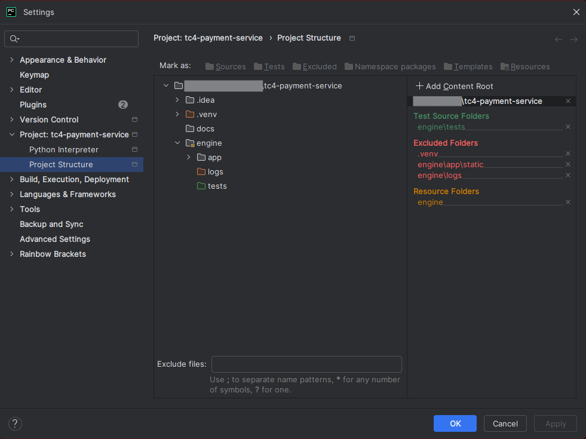
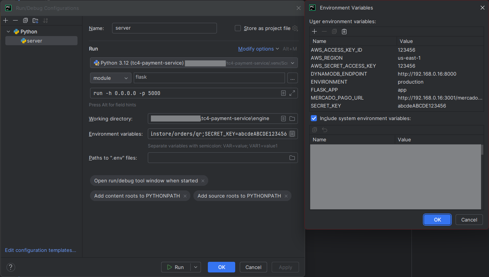

<h1 align="center">Fast Food FIAP Tech Challenge 4 - Payment Service</h1>

<p align="center">
    
    
    
    
</p>

## Introduction

This document describes the payment microservice, a core component of the microservices ecosystem that powers the 
order management system of a fast food platform. The system is composed of several independent services — such as 
orders, identification, kitchen, and others — which collaborate to ensure efficient, scalable, and resilient operations. 
The payment microservice is responsible for processing financial transactions, validating payment status, and notifying 
the system once a payment has been completed, allowing orders to proceed through the workflow toward preparation and 
delivery.

### Role Within the Ecosystem

The main responsibility of this service is to handle customer payments. It acts as the bridge between the internal 
system and the payment provider (simulated via a mock of Mercado Pago in this case), and manages the persistence of 
payment information, error handling, and inter-service communication through Amazon SNS, which is used to broadcast 
events like "payment approved" or "payment declined."

This service communicates with other microservices in an asynchronous manner, using event-driven communication to 
ensure loose coupling between components. This design promotes independent scalability and evolution of each service, 
while also enhancing testability, maintainability, and observability.

### Technologies Used

The payment microservice was developed using Python with the Flask microframework, selected for its lightweight 
nature and flexibility, which are ideal for API-centric services. Data persistence is handled using Amazon DynamoDB, 
a highly scalable NoSQL database, accessed via the PynamoDB library — a Pythonic, object-mapper-style interface 
over DynamoDB.

For inter-service messaging and event notifications, the service uses Amazon SNS (Simple Notification Service), 
a robust solution for publish-subscribe messaging, enabling efficient propagation of payment events to other 
interested services.

The payment integration is simulated using a mock version of Mercado Pago, allowing the service’s internal logic 
to be tested in isolation, without relying on external systems during development and testing.

### Architecture and Best Practices

The project follows Clean Architecture principles, structuring the codebase to clearly separate concerns, 
facilitate automated testing, and ensure the core business logic remains independent from frameworks, external 
libraries, and infrastructure. This approach supports a maintainable, highly cohesive, and loosely coupled 
architecture, suited for long-term scalability and evolution.

Throughout the project, several software engineering best practices were applied.

## Project Structure Explained

#### `engine/app/configs/`
**Purpose**: Configuration Layer (Infrastructure)

- `environment.py`: Manages environment variables and settings (e.g., port, debug, credentials).
- `log.py`: Centralized logging configuration used across the application.

#### `engine/app/core/`
**Purpose**: Core Business Logic (Inner Layer)

- `controllers/`: Application-level logic that coordinates use cases and manages workflow. Acts as a bridge between routes and use cases.
- `entities/`: Contains domain models representing the core business rules. These are pure Python classes and have no dependencies.
- `presenters/`: Prepares data formats to be returned to external interfaces.
- `usecases/`: Application use cases. These are responsible for executing business rules and coordinating entities. Each use case encapsulates a specific business action.

**This is the most protected layer. It should never import anything from the external or infrastructure layers.**

#### `engine/app/external/`
**Purpose**: Interface Adapters (Outer Layer)

- `flask/`: Contains HTTP interface logic.
  - `routes/`: API endpoint definitions using Flask.
- `schemas/`: Request schemas for serialization and validation.

These modules are **adapters**, translating external HTTP or JSON input into something understandable by the inner layers.

#### `engine/app/repositories/`
**Purpose**: Data Persistence Layer (Adapter)

- `models/`: PynamoDB models that define how data is structured in DynamoDB.
- `paymentRepository.py`: Implements repository interface used by use cases. It wraps access to the **models** and abstracts the database.

#### `engine/app/services/`
**Purpose**: External Services (Infrastructure Layer)

- `amazon_sns/`: Handles integration with AWS SNS to publish payment-related events.
- `mercado_pago/`: Integration layer for Mercado Pago (mocked in this case). Contains logic to communicate with the external payment provider.

These services are injected into use cases through interfaces, so the business logic is not tightly coupled to third-party SDKs.


## How to work on the application

- Make sure your **python** is the **same** version **3.12**
- Install the required dependencies inside your **venv** located on **b10/requirements.txt** with:
```shell
pip install -r engine/requirements.txt
```

### Environment vars

Set this env vars to ensure the applications runs smoothly.

| Name                  | Example                                               | Description                                                                           |
|-----------------------|-------------------------------------------------------|---------------------------------------------------------------------------------------|
| AWS_ACCESS_KEY_ID     | 123456                                                | AWS Access Key ID                                                                     |
| AWS_SECRET_ACCESS_KEY | 123456                                                | AWS Secret Access Key                                                                 |
| AWS_REGION            | us-east-1                                             | AWS region                                                                            |
| MERCADO_PAGO_URL      | https://mercadopago.com/mercadopago/instore/orders/qr | Mercado Pago endpoint                                                                 |
| ENVIRONMENT           | production                                            | environment context (testing/development/production)                                  |
| FLASK_APP             | app                                                   | flask application                                                                     |
| SECRET_KEY            | abcdeABCDE123456                                      | secret key that will be used to encrypt data and flask session, needs to be 16 length |
| DYNAMODB_ENDPOINT     | https://dynamoDB-host:8000                            | Dynamo DB host address                                                                |


### Pycharm configs

This docs will be using pycharm, but it can be configured in any other IDE

First mark your directories like described bellow:

- **engine directory** marked as **resource root**
- **engine/logs directory** marked as **excluded**
- **engine/app/static directory** marked as **excluded**
- **engine/tests directory** marked as **test source root**

It should be like this:




### Run configuration

- working dir: **engine**
- module name: **flask**
- param: **run -h 0.0.0.0 -p 5000**




[//]: # (### Tests configuration)

[//]: # ()
[//]: # (- working dir: **engine**)

[//]: # (- script path: **engine/tests**)

[//]: # ()
[//]: # (![tests configs]&#40;docs/tests-configs.png&#41;)

[//]: # ()
[//]: # ()
[//]: # ()
[//]: # ()
[//]: # ()
[//]: # (docker run --rm -d -p 3001:3001 -v "$&#40;pwd&#41;/definition.json:/data/definition.json" mockoon/cli:9.2.0 --data /data/definition.json --port 3001)

